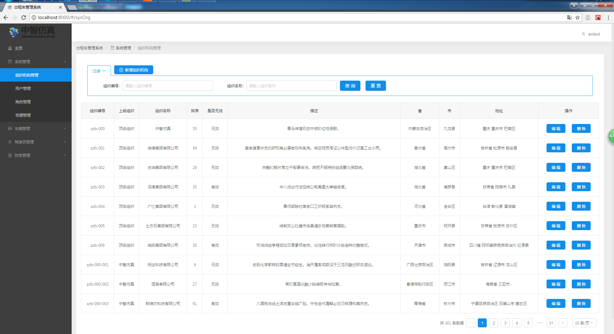
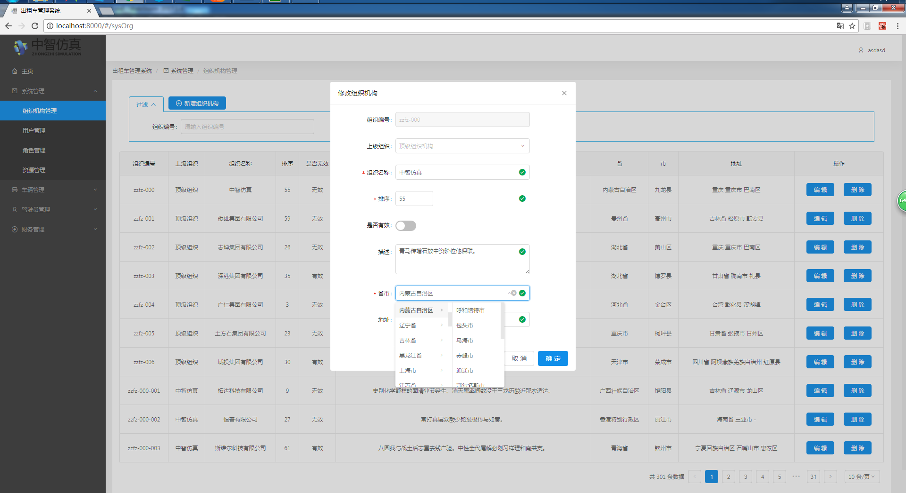
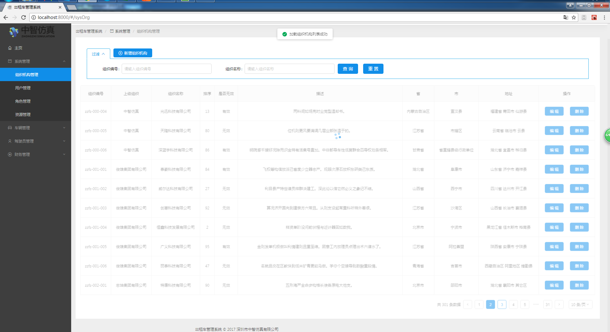
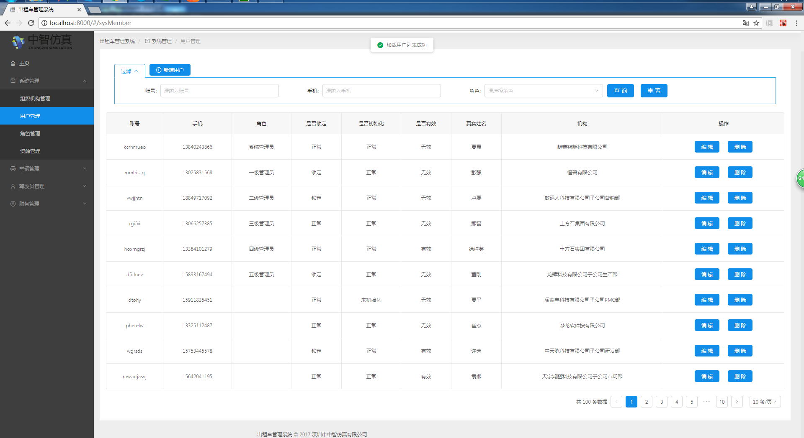
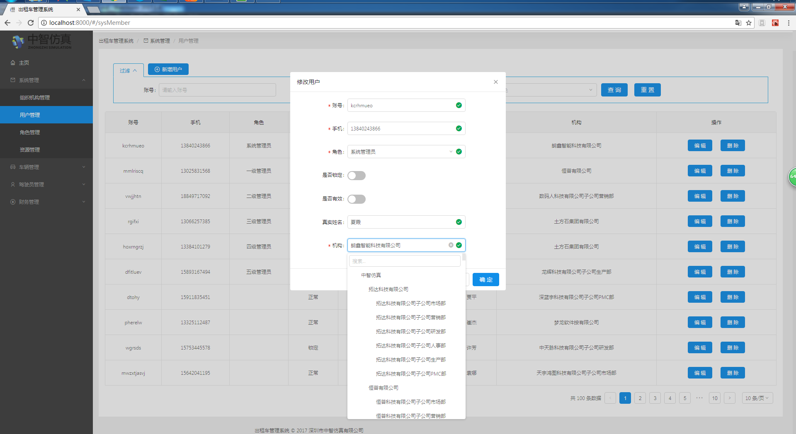
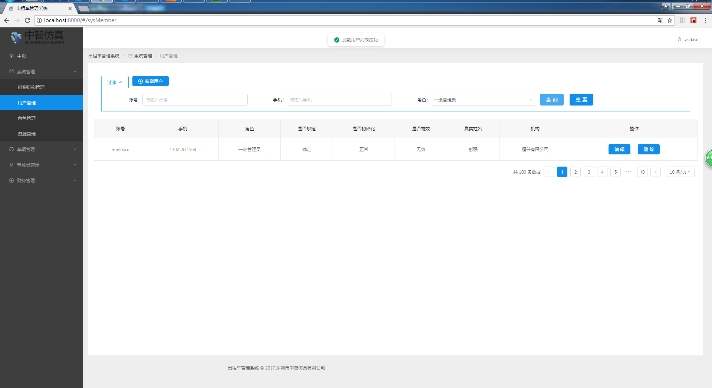
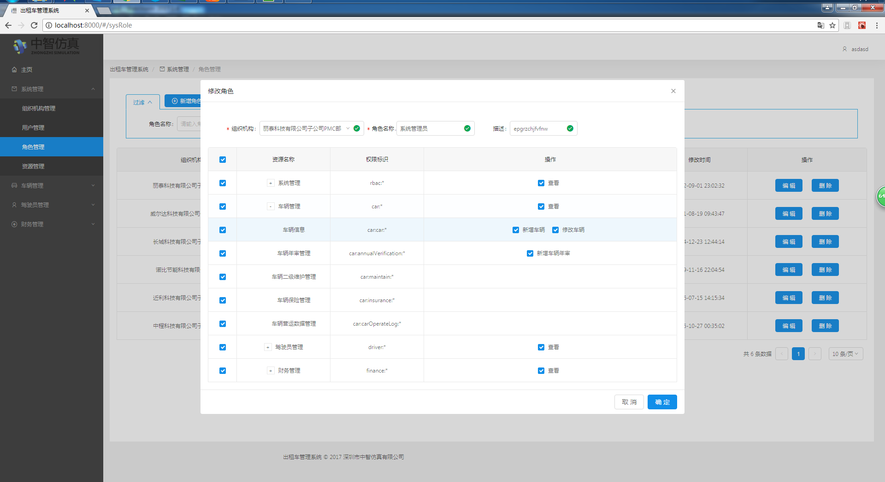
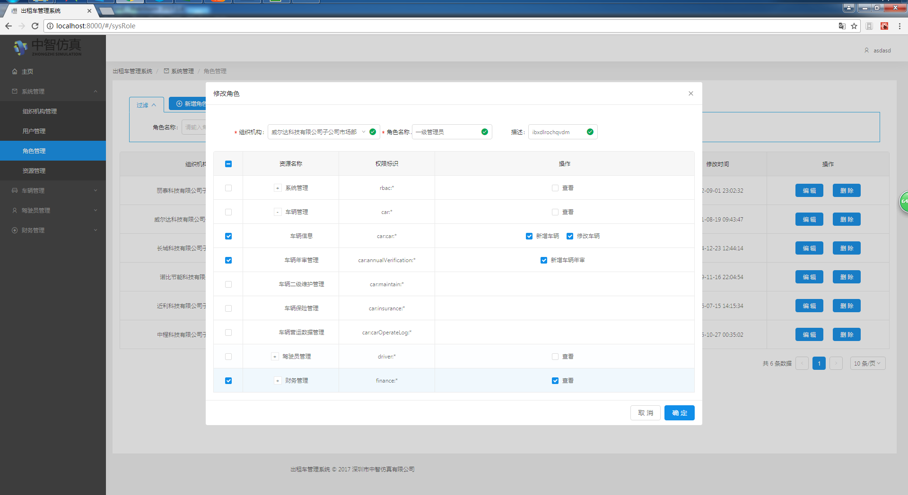
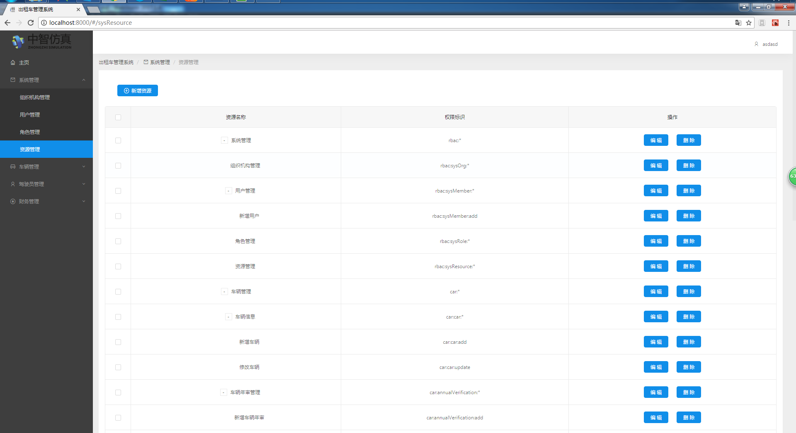
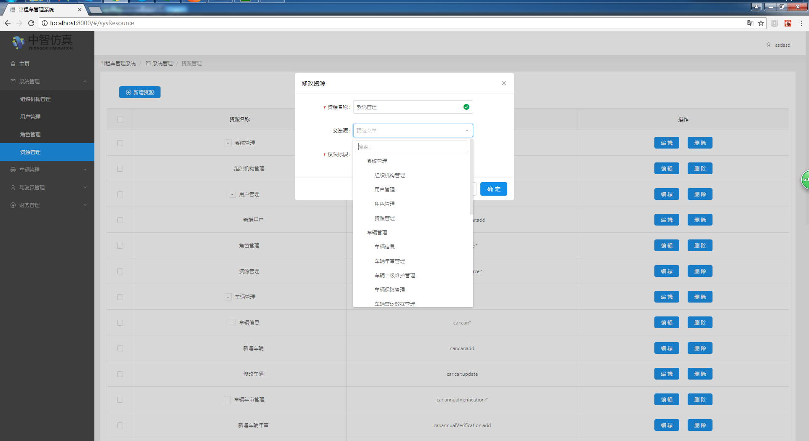

项目说明
---

基于 react + dva + roadhog + antd 构建的后台管理项目

首次提交完成：
* 项目内 mock
  * 组织机构 sysOrg
  * 角色 sysRole
  * 用户 sysMember
  * 资源 sysResource
* 系统管理
  * 组织机构管理 CURD
  * 角色管理 CURD
  * 用户管理 CURD
  * 资源管理 CURD

特色：
* 内嵌 carno 工具包
* 对 carno 工具包添加功能
  * 添加 axios 工具，提供 get/post 功能，model 内直接发起请求
  * 添加同步请求工具 sync-request，提供 get/post 功能
  * 添加对象、数组比对 diff/same，用来做修改前判断
  * 添加 arrayToMap、arrayToTree、treeToArray 处理三种数据机构
  * 添加 import R from 'ramda'、 import _ from 'lodash' 两款数据结构处理工具，极其方便
  * 添加 localCache/sessionCache 缓存封装，对 locatStorage 添加时效功能
  * 添加 tableBindType、formBindType 用来处理异步 id 转 name
* 动态路由


### 如何运行
```
> cnpm i
> npm run dev
```
打开游览器访问 http://127.0.0.1:8000


### 图片欣赏












